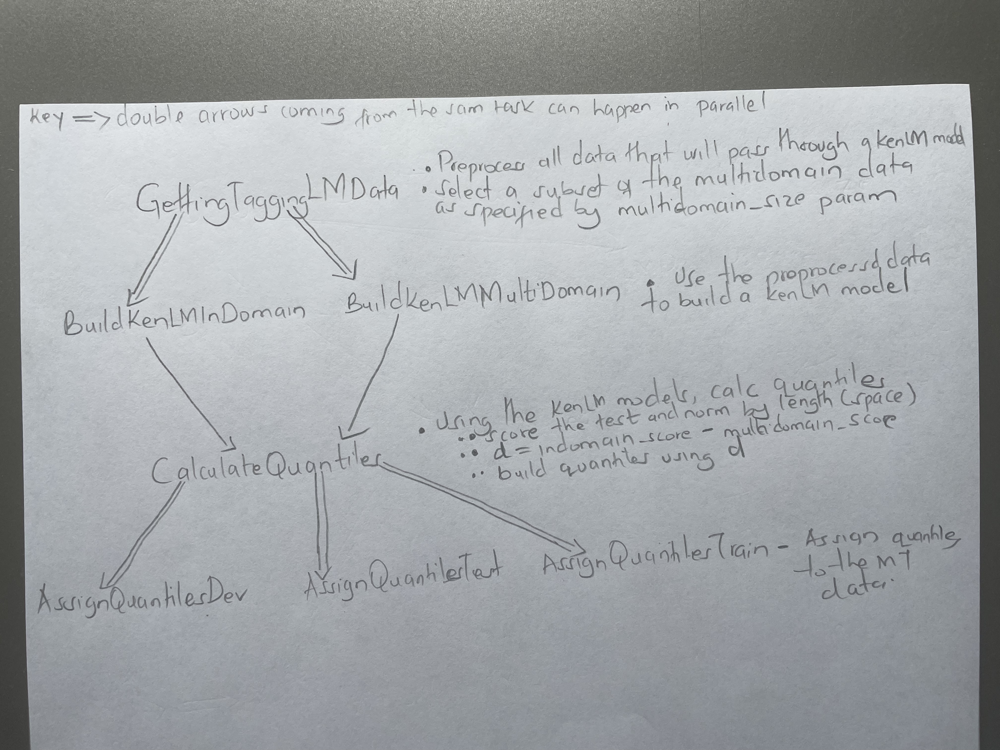

# Domain Tagging

Based on:
- [Intelligent Selection of Language Model Training Data](https://aclanthology.org/P10-2041/)
- [Tagged Back-Translation](https://arxiv.org/abs/1906.06442)

## Setup
tir directory - `/projects/tir6/general/aogayo/models/domaintag`

We use Ducttape to run experiments
We use Fairseq libary for MT training

- Install [KenLM](https://github.com/kmario23/KenLM-training) and its dependencies
- Install packages in [requirements.txt](/requirements.txt)
- 
### Tokenization
We assume you already have a trained spm model for tokenization that is to be used for all runs.

### Ducttape Graph

### Running
